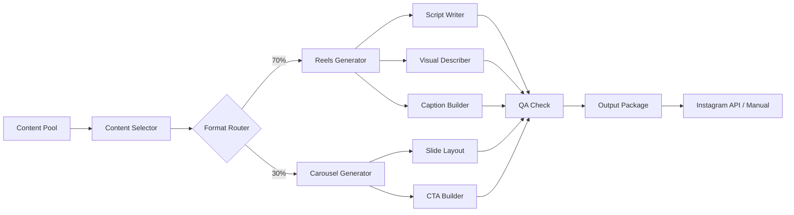

# Instagram Content Agent — Адаптация контента для Instagram

> Превращаем экспертные посты @eddytester в Instagram-контент для начинающих QA и желающих войти в IT через тестирование.

---

## Research Brief

Исследование проведено: `research_адаптация_технического_контента_по_тести_2026-05-14.md`

### Ключевые выводы

1. **Instagram-алгоритм 2026** приоритезирует Reels с высоким удержанием. Статичные слайд-шоу («экспертные» карусели) теряют 50-70% охватов.
2. **Carousel** даёт 10% engagement (vs 6% Reels), но не конвертирует в Telegram без явного CTA.
3. **Формула успешного Reels**: 3 сек баг/ошибка → 7 сек разбор → 5 сек фикс. С обязательным движением на экране (терминал, клики, анимация).
4. **Метрики**: сохранения — vanity. Реальная метрика — CTR ссылки в био (> 0.5%) и конверсия в Telegram (> 2% от сохранений).
5. **AI-визуалы** требуют QA: нейросеть рисует красиво, но часто искажает техническую суть.

---

## Архитектура агента



### Компоненты

#### 1. Content Selector
- Вход: пул постов из Content Map (посты @eddytester)
- Критерии отбора:
  - Конкретный баг с «до/после» (Reels)
  - Чек-лист / список правил (Carousel)
  - История из реального продакшена (Reels)
  - Не подходит: абстрактные рассуждения, длинные теоретические разборы
- Выход: тема + референсный пост + BEST_ANGLE

#### 2. Format Router
- Reels (70%): баги, инциденты, быстрые фиксы, демо инструментов
- Carousel (30%): чек-листы, сравнения, пошаговые руководства, метрики

#### 3. Reels Generator

**Script Writer:**
- Структура:
  - 0-3 сек: хук — экран ошибки, curl с 500, неожиданное поведение
  - 3-10 сек: разбор — что пошло не так, как тестировать
  - 10-15 сек: фикс — решение, успешный ответ, CTA
- Голос за кадром: эмоциональный, естественный, без канцелярита
- Правила:
  - Одна чёткая мысль на Reels
  - Ключевые слова в голосе (алгоритм индексирует речь)
  - Текст на экране — минимум, только ключевые термины

**Visual Describer:**
- Формат: запись экрана терминала (OBS, ScreenFlow)
- Элементы:
  - Реальный curl с ошибкой
  - Исправленная команда
  - Живая реакция (удивление, «ага!»)
- AI-визуалы: только после QA-проверки на техническую точность

**Caption Builder:**
- Первая строка — hook (вопрос или провокация)
- 2-5 хештегов (#qa #apitesting #manualtesting #тестирование #backend)
- CTA: ссылка в био (+ причина перейти)

#### 4. Carousel Generator

**Slide Layout:**
- 5-7 слайдов
- Слайд 1: проблема + hook
- Слайды 2-5: суть (каждый слайд — одна мысль)
- Слайд предпоследний: чек-лист / вывод
- Слайд последний: CTA + QR-код / ссылка в био

**CTA Builder:**
- Текст: «Больше таких разборов — в Telegram @eddytester»
- Ссылка: bit.ly/eddytester (с UTM-метками)
- QR-код в конце карусели (повышает CTR на 1.2% по данным бенчмарков)

#### 5. QA Check

Проверки перед публикацией:
- **Визуальная метафора**: показать 3-5 джунам, попросить описать одним предложением. Если описание расходится с техсутью — переделать.
- **Техническая точность**: AI-сгенерированные изображения проверить на соответствие протоколу (цвета, стрелки, направления запросов)
- **Удержание**: первые 3 сек > 70%, досмотр > 25%
- **CTA**: есть ли явный призыв перейти в Telegram?

#### 6. Output Package

Для каждого поста:
- Reels: скрипт + описание визуального ряда + caption + хештеги
- Carousel: текст каждого слайда + макет + caption
- Метрики для отслеживания: охват, retention 3s, сохранения, CTR ссылки, конверсия в Telegram

---

## Форматы контента

### Reels (15 сек) — 70% контента

**Шаблон сценария:**
```
[0-3 сек] Экран: curl с ошибкой 500 / неожиданный response
Голос: "Смотри. Тесты зелёные, а в проде — 500."

[3-10 сек] Экран: разбор причины (параметр, заголовок, токен)
Голос: "Почему? Потому что [короткое объяснение]."

[10-15 сек] Экран: исправленная команда, успешный 200
Голос: "Фикс — [что изменить]. Больше таких кейсов — ссылка в описании."
```

**Примеры тем:**
- «Тесты зелёные, продакшн красный» — баг с разными токенами/scope
- HTTP 204 + Content-Length — cURL висит, fetch проходит
- Blind SQLi — CASE WHEN в ORDER BY
- CORS с * + credentials

### Carousel (5-7 слайдов) — 30% контента

**Шаблон:**
```
Слайд 1: Проблема (вопрос или провокация)
Слайд 2-3: Конкретный баг / кейс
Слайд 4: Как тестировать (curl / чек-лист)
Слайд 5: Вывод / правило
Слайд 6: CTA + QR-код
```

**Примеры тем:**
- «5 багов аутентификации за 15 минут» — чек-лист
- «HTTP headers: 6 проверок» — готовый сценарий регресса
- «Postman: 4 привычки» — best practices

---

## Метрики и OKR

| Метрика | Бенчмарк | Инструмент |
|---------|----------|------------|
| Retention первых 3 сек | > 70% | Instagram Insights |
| Досмотр Reels | > 25% | Instagram Insights |
| Сохранения карусели | > 500 | Instagram Insights |
| CTR ссылки в био | > 0.5% | Instagram Insights + UTM |
| Конверсия сохранение → Telegram | > 2% | Telegram Stats |
| Новые подписчики из Instagram | > 10/нед | Telegram Stats |

---

## Инструменты

### Планирование и публикация
- **Later / Buffer** — планирование постов
- **Instagram Creator Studio** — аналитика
- **Meta Graph API** — автоматическая публикация

### Создание контента
- **OBS / ScreenFlow** — запись экрана терминала
- **Canva** — карусели, AI-визуалы с ручной правкой
- **After Effects + Plainly API** — автоматизация видеошаблонов

### AI
- DeepSeek / ChatGPT — генерация сценариев, captions
- DALL·E / Midjourney — визуалы (требуют QA-проверки)

---

## Связь с экосистемой

```
Instagram (Reels/Carousel) → Hook → Telegram @eddytester → Глубокий контент
                                          ↓
                                    API Practicum → Продукт
```

- Instagram — верх воронки: привлекаем внимание, показываем "мясо"
- Telegram — середина: полные разборы, комьюнити, доверие
- API Practicum — низ: конверсия в продукт

Instagram-контент НЕ должен быть самодостаточным. Задача — заставить перейти в Telegram.

---

## Ограничения и риски

1. **Instagram API ненадёжен** — тестовый токен работает, продакшен — нет (реальный кейс: webhook scope)
2. **Алгоритм меняется** — стратегия требует ревизии раз в 3-6 месяцев
3. **B2B EdTech в Instagram** — нишевая аудитория, медленный рост
4. **AI-визуалы врут** — обязательная проверка технической точности перед публикацией
5. **Reels production** — запись экрана с терминалом требует времени и монтажа

---

## Next Steps

1. Выбрать 3 поста из пула для пилота
2. Сделать тестовые Reels (вручную, для проверки гипотезы)
3. Замерить первые 2 недели метрик
4. По результатам — запускать агента в автоматический режим
