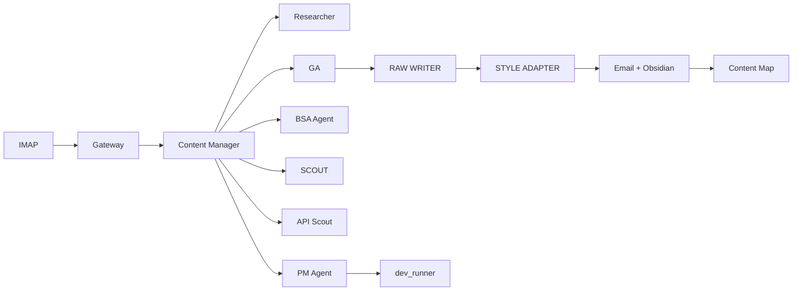

# Оркестратор Wiki

> Продюсерский центр @eddytester. Ты — актёр. Агенты — продакшн.

---

## Архитектура

Архитектура построена вокруг **Content Manager** — оркестратора, который запускается по крону и проходит полный цикл: контекст → идея → ресерч → контент → доставка.

Узлы делятся на три слоя:

### Слой 1: Источники и контекст

| Компонент | Роль |
|---|---|
| [[Bitwarden Vault]] | Единое хранилище ключей (DeepSeek, GitHub, Resend, Serper). Все агенты читают через `BWVault`. |
| [[IMAP]] | GetCourse → inbox → gateway.py → команды (`dev:`, `тг 1`, `в пул:`, `зашквар:`, `бэклог:`) |
| [[Obsidian Vault]] | Персистентность: посты, стратегия, SCOUT, дайджесты, Content Map. GitHub-синк каждые 10 мин. |
| [[GitHub]] | Репозитории: blog-analysis, v0-test-api, free-trial-api, api-practicum-bot, notes (vault). |

### Слой 2: Агенты

| Агент | Файл | Назначение |
|---|---|---|
| **Content Manager** | `content_manager.py` | Оркестратор. Пул тем → ресерч → GA → RAW WRITER → STYLE ADAPTER → email + Obsidian. Точка входа. |
| **GA (General Analyst)** | `ga_review_brief()` внутри CM | Стратегический мозг. Ревьюит брифы, выбирает угол, эволюционирует стратегию. Промпт: `ga_prompt.txt`. |
| **Researcher** | `researcher.py` | Ищет темы через SearXNG. Берёт тему из пула → 5-7 вопросов → research brief. |
| **PM Agent** | `pm_agent.py` | Оценивает dev-задачи. Вердикты GO/NO_GO. `GO + CODE` → авто-запуск через dev_runner. |
| **BSA Agent** | `bsa_agent.py` | Еженедельный стратегический аудит. 3-5 Strategic Bets по всему бизнесу. Многорундовый диалог. |
| **SCOUT Scanner** | `scanner.py` | Анализ конкурентов (tdl, 10 каналов). Репорты → Obsidian `Стратегия/Конкуренты/`. |
| **API Scout** | `api_scout.py` | Product PM Agent. Сканирует репозитории, issues, PR, код. DeepSeek-анализ → GitHub issues. |
| **Digest Agent** | `digest_agent.py` | Ежедневный дайджест 08:00 MSK. Пульс системы, посты, dev-поток, BSA ставки, SCOUT gaps. |
| **Resender/Wisher** | `news_agent.py` | Еженедельный NEWS дайджест. DuckDuckGo → DeepSeek selection → enrichment → email. |
| **STYLE ADAPTER** | Внутри CM, `style_adapter()` | Причёсывает RAW CONTENT под стиль канала. Никаких шаблонов, естественный язык. |
| **RAW WRITER** | Внутри CM, `raw_write_content()` | Экстракт всей полезной информации из research brief без стиля. |

### Слой 3: Инфраструктура

| Компонент | Где | Назначение |
|---|---|---|
| `bw serve` | localhost:8087 | Bitwarden демон для всех агентов |
| `.env` | `agents/.env` | Fallback для ключей (если BWVault недоступен) |
| `.mailcfg` | `agents/.mailcfg` | Resend SMTP конфиг |
| `CHRON.md` | корень | Лог крон-чеков (рантайм, gitignored) |
| `data/content_map_index.json` | `data/` | Индекс постов по тегам (Content Map) |

---

## Поток данных



**Полный цикл Content Manager:**
1. Phase 0: Проверка email-команд (gateway.check_mail)
2. Phase 0.5: Анализ wishlist
3. Phase 1: GA выбирает тему из пула
4. Phase 2: Researcher → research brief
5. Phase 3: GA ревью → вердикт + BEST_ANGLE + релевантные прошлые посты
6. Phase 3.5: RAW WRITER — экстракт всего полезного
7. Phase 4: STYLE ADAPTER — пост для канала
8. Phase 4 (old): Channel Agent — пост для сравнения
9. Phase 5: Email + сохранение в Obsidian + Content Map

---

## Кроны

| Расписание (MSK) | Команда                                 | Ответственный          |
| ---------------- | --------------------------------------- | ---------------------- |
| 08:00 ежедневно  | `digest_agent.py`                       | Ежедневный дайджест    |
| 09:00 ПН         | `api_scout.py --repo v0-test-api`       | API Scout              |
| 09:00 СР         | `api_scout.py --repo free-trial-api`    | API Scout              |
| 09:00 ПТ         | `api_scout.py --repo api-practicum-bot` | API Scout + News Agent |
| 09:00 ВС         | `bsa_agent.py`                          | Стратегический аудит   |
| 09:00 СР         | `bsa_agent.py --auto-finalize`          | Авто-финализация BSA   |
| Каждые 2 дня     | Content Manager (ресерч)                | Контент-цикл           |
| Каждые 30 мин    | `gateway.py check_mail`                 | Проверка команд        |

---

## Email-команды (IMAP → Gateway)

Отправляешь письмо на ящик — gateway парсит тему и тело:

| Команда | Действие |
|---|---|
| `dev: <задача>` | PM Agent → вердикт → если GO → dev_runner |
| `тг 1` | Пост одобрен |
| `зашквар: <тема>` | Тема в blacklist |
| `в пул: <тема>` | Добавить тему в пул |
| `бэклог <идея>` | Добавить идею в wishlist |
| `правка: <текст>` | Правка поста |

---

## Git-воркфлоу

```
[Mac] редактируешь → git push → [Server] git pull
[Server] изменения → git push → [Mac] git pull
```

1. Всегда через ветку
2. Тест на сервере
3. Мерж в main
4. Pull на сервере

---

## Рекомендации

### Для Эда (актёра)

1. **Не редактируй агентов в проде.** Ветка → тест → main. Сервер сам подтянет.
2. **Email-команды быстрее SSH.** `dev: ...`, `в пул: ...`, `бэклог ...` — gateway обработает за 30 мин.
3. **Проверяй дайджест.** Digest Agent — твой ежедневный пульс. Если агенты не работают — ты увидишь.
4. **BSA требует ответа.** После воскресного аудита ответь `принято` или дай правки. Без ответа — авто-финализация в среду.
5. **Bitwarden — всё.** Если добавил новый сервис/ключ — сохрани в Bitwarden. Агенты найдут сами.

### Для агентов (продюсерского центра)

1. **BWVault — первый приоритет.** Никогда не храни ключи в коде. `.env` — только fallback.
2. **Пиши в Obsidian.** Посты → `Посты/`, стратегия → `Стратегия/`, SCOUT → `Стратегия/Конкуренты/`.
3. **Не спамь.** Единственное письмо пользователю — Digest Agent. Всё остальное либо в Obsidian, либо в GitHub issues.
4. **Агенты кормят агентов.** SCOUT → BSA/GA. API Scout → GitHub issues. PM Agent → dev_runner. Не жди команды, если знаешь что делать.
5. **Content Map.** После каждого поста обновляй индекс. GA перед ревью запрашивает релевантные прошлые посты.

---

## Структура репозиториев

| Репозиторий | Назначение |
|---|---|
| `github.com/overgoer/blog-analysis` | Все агенты, промпты, конфиги |
| `github.com/overgoer/notes` | Obsidian vault (синк Mac ↔ сервер) |
| `github.com/overgoer/v0-test-api` | API Practicum v1 (баги) + v2 (эталон) |
| `github.com/overgoer/free-trial-api` | Бесплатное API для демо |
| `github.com/overgoer/api-practicum-bot` | TG бот для воронки |

---

## Сервер

- **Хост:** 217.144.185.210 (root)
- **Второй сервер:** 85.193.81.51
- **Директория агентов:** `/root/blog-analysis/`
- **Obsidian vault:** `/root/obsidian-vault/eddytester/`
- **Логи:** `/root/blog-analysis/logs/*.log`
- **Bitwarden:** `bw serve` на порту 8087 (systemd, авто-рестарт)
